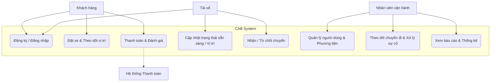

```mermaid
graph TD
    %% Actors
    C[Khách hàng]
    D[Tài xế]
    O[Nhân viên vận hành]
    P[Hệ thống Thanh toán]

    subgraph CAB System
        UC1(Đăng ký / Đăng nhập)
        UC2(Đặt xe & Theo dõi vị trí)
        UC3(Thanh toán & Đánh giá)
        
        UC4(Cập nhật trạng thái sẵn sàng / Vị trí)
        UC5(Nhận / Từ chối chuyến)
        
        UC6(Quản lý người dùng & Phương tiện)
        UC7(Theo dõi chuyến đi & Xử lý sự cố)
        UC8(Xem báo cáo & Thống kê)
    end

    %% Customer Relations
    C --> UC1
    C --> UC2
    C --> UC3

    %% Driver Relations
    D --> UC1
    D --> UC4
    D --> UC5

    %% Operator Relations
    O --> UC6
    O --> UC7
    O --> UC8

    %% System Interactions
    UC3 .-> P
```
